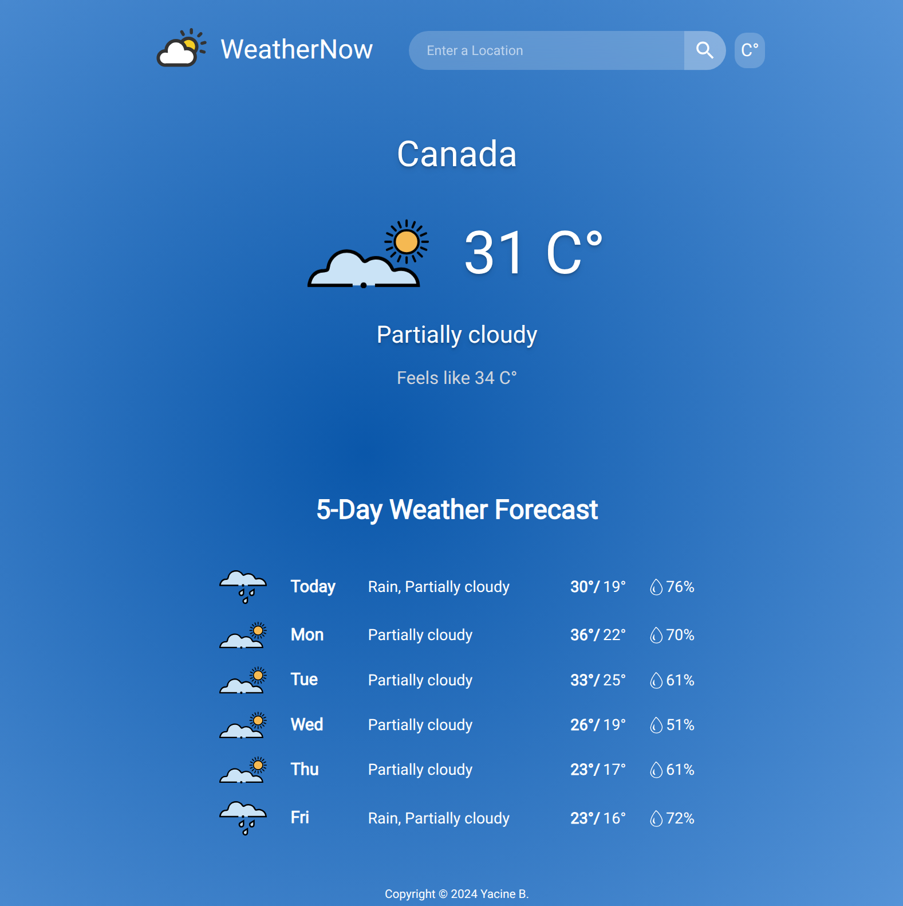

# Weather App

Simple app to get weather conditions in a specific location.



# [Live Preview](https://3antozz.github.io/Weather-app)

## Why build this project ?

This was a project assignment from The Odin Project's Javascript course. The intention of this was to practice working with APIs and asynchronous code.

## Features

- Get current weather conditions.
- Get 5 day weather forecast
- Switch between imperial and metric systems.
- Responsive design.

## Technologies Used

- HTML
- Javascript
- Tailwind
- Webpack
- Jest

## 🛠️ How to Run the Project Locally

### Prerequisites

- [Node.js](https://nodejs.org/)
- [npm](https://www.npmjs.com/)

---

### 1. Clone the Repository

```bash
git https://github.com/3antozz/Battleship
cd Weather-app
```

2- Start the server:

```bash
npm install
npm run dev
```
> [!NOTE]
> The server will run on http://localhost:8080 by default.

### 3. Open in Browser

1- Once the server is running:

2- Visit http://localhost:8080 in your browser
